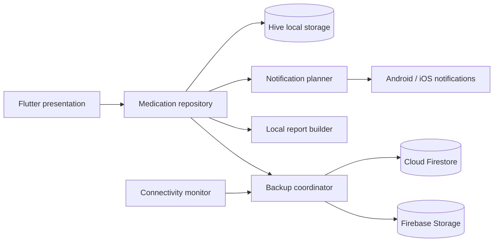

<p align="center">
  
</p>

<h1 align="center">MediMind</h1>

<p align="center">
  A bilingual, local-first medicine reminder and adherence tracker built for dependable everyday use.
</p>

<p align="center">
  
  
  
  
</p>

MediMind helps people schedule medicines, receive timely reminders, record
whether a dose was taken, and review adherence history. The application is
designed around a local-first model: Hive is the source of truth, reminders
continue to work without internet access, and Firebase provides private cloud
backup when connectivity is available.

The interface supports Bengali and English, while every displayed time uses a
consistent English 12-hour `AM/PM` format.

## Table of Contents

- [Highlights](#highlights)
- [Features](#features)
- [Reminder Experience](#reminder-experience)
- [Architecture](#architecture)
- [Technology Stack](#technology-stack)
- [Project Structure](#project-structure)
- [Getting Started](#getting-started)
- [Firebase Setup](#firebase-setup)
- [Platform Configuration](#platform-configuration)
- [Development](#development)
- [Testing](#testing)
- [Release Builds](#release-builds)
- [Security and Privacy](#security-and-privacy)
- [Known Platform Constraints](#known-platform-constraints)
- [License](#license)

## Highlights

| Capability | What MediMind Provides |
| --- | --- |
| Reliable reminders | Exact local scheduling, sound, vibration, lock-screen visibility, and Android screen wake |
| Quick action | Mark a medicine taken or not taken from Android notifications |
| Grouped doses | Medicines due in the same minute are presented in one clear reminder |
| Local-first data | Medicines, check-ins, reports, and pending deletions remain available offline |
| Cloud backup | Change-driven Firebase backup with retries, progress feedback, and manual control |
| Bilingual UI | Bengali-first interface with English switching and consistent typography |
| Clear time display | English 12-hour `AM/PM` formatting in both language modes |
| Adherence reports | Local 7-day and 30-day medicine history |
| Responsive design | Phone-friendly layouts with wider-screen support |

## Features

### Medicine Management

- Add, edit, inspect, and delete medicine reminders.
- Confirm destructive medicine deletion through a localized Yes/No dialog.
- Supported medicine types:
  - Tablet
  - Capsule
  - Syrup
  - Drop
  - Insulin
- Record medicine strength using `mg`, `g`, `mcg`, or `units/ml`.
- Store optional formula or generic name, company name, notes, and a medicine
  photo.
- Add multiple dose times to one medicine.
- Assign a separate dosage value to every dose time.
- Derive dosage units from the medicine type:

  | Medicine Type | Dosage Unit |
  | --- | --- |
  | Tablet | Pill |
  | Capsule | Pill |
  | Syrup | Millilitre |
  | Drop | Drop |
  | Insulin | Unit |

- Detect likely duplicate reminders when at least two identity signals match:
  medicine name, dosage signature, or formula.
- Preserve legacy local records through backward-compatible deserialization.

### Recurrence and Scheduling

- Daily reminders.
- Weekly reminders.
- Every-15-days reminders.
- Monthly reminders that preserve the starting day where possible and use the
  last valid day in shorter months.
- Custom intervals from 1 through 365 days.
- The selected `scheduleFrequency` is the recurrence source of truth.
- `customIntervalDays` is stored only for custom schedules and removed from
  Firestore for all predefined schedules.
- Reminder planning uses the `Asia/Dhaka` time zone.
- Same-minute medicines are merged into one reminder event.
- Up to 360 future Android events are scheduled at a time; iOS uses a smaller
  platform-appropriate horizon.

### Dose Tracking

- Mark a scheduled medicine as taken or not taken.
- Record the actual time when a medicine was taken.
- Edit a medicine consumption record from the medicine detail sheet.
- Show quick status actions five minutes before a dose is due.
- Remove those actions after the occurrence has been recorded, preventing the
  next reminder from appearing as the current action target.
- Apply Android notification actions safely even when the Flutter UI is not
  running.
- Refresh reports and queue a backup after adherence state changes.

### Dashboard

- A live day-cycle arc that begins at the current time and ends at the next
  meaningful medicine event.
- Current and endpoint times displayed in English 12-hour `AM/PM` format.
- Live due-in countdown inside the arc.
- Upcoming same-time medicine groups presented as one event.
- Centered Today and Active summary metrics.
- Superscript English date suffixes such as `23rd` and `14th`.
- Responsive Add medicine and Backup actions displayed side by side.
- Branded, responsive application header using the MediMind logo.
- Medicine cards with schedule, dosage, status, and optional local artwork.
- Pull-to-refresh support.

### Reports

- Rolling 7-day and 30-day adherence views.
- Medicine taken and not-taken totals.
- Scheduled time and actual recorded time.
- Detailed history grouped by calendar date.
- Reports generated from local check-in data without requiring internet.
- Historical report entries retained when a medicine is later deleted.
- Owner-scoped report snapshots backed up to Firestore.

### Authentication

- Bangladesh phone-number authentication through Firebase.
- Google/Gmail authentication.
- Common Bangladesh phone formats are normalized to Firebase-compatible E.164
  format.
- Bengali digits, whitespace, parentheses, and hyphens are accepted in phone
  input.
- Inline loading feedback while sending an OTP, verifying a code, or signing
  in.
- Persistent mobile sessions with automatic sign-out after 30 days of
  inactivity.

### Localization and Accessibility

- Bengali is selected by default.
- English can be selected from the language control.
- Language preference is stored once per device and survives sign-in,
  sign-out, force-stop, and restart.
- Different devices may keep different language choices for the same account.
- All times remain English 12-hour `AM/PM` strings in both modes.
- Matching semantic font weights keep Bengali and English emphasis consistent.
- Bundled Manrope and Noto Sans Bengali fonts work without a network request.
- Tooltips, semantic logo labels, stable control dimensions, and responsive
  text behavior support accessible interaction.

### Branding

- Custom MediMind launcher icon at every Android density.
- Adaptive and round Android launcher icons.
- Branded legacy and Android 12+ splash screens.
- Tasteful logo placement on sign-in and active reminder surfaces, with the
  MediMind wordmark restored on the dashboard.
- Android-compatible monochrome notification icon.

### Local-First Storage and Backup

- Hive stores medicine records locally and remains the source of truth.
- Local medicine records are isolated by account on shared devices.
- Signing in first checks Firestore and stores missing cloud reminders locally.
- When the same reminder exists locally and in Firestore, the most recently
  updated version wins.
- A local save completes before report generation, notification rescheduling,
  or cloud work.
- Background maintenance is serialized and coalesced for responsive UI.
- Automatic backup is triggered by state changes rather than a polling loop:
  - Medicine added
  - Medicine edited
  - Medicine deleted
  - Medicine marked taken or not taken
- Manual backup remains available from the dashboard.
- The Backup button displays a spinner and `Backing up...` during manual or
  automatic uploads.
- Backups retry when connectivity returns.
- Failed transient uploads use increasing retry delays.
- Permission failures pause repeated cloud attempts while local functionality
  remains available.
- Local deletion tombstones ensure the next successful backup also removes
  deleted cloud records.
- Medicine image bytes remain available locally; Firebase Storage stores the
  cloud copy when configured.

## Reminder Experience

### When Another App Is Open

Android shows a high-priority heads-up banner and adds the reminder to the
notification panel. The alert includes sound, vibration, medicine details, and
Taken/Not taken actions. MediMind does not force itself over the current app.

### When the Phone Is Locked

A companion `RTC_WAKEUP` alarm briefly wakes the Android display without
launching MediMind. The high-priority notification then appears on the lock
screen with sound, vibration, grouped medicine details, and actions.

### When MediMind Is Open

The app presents a centered reminder dialog over a blurred background. It
includes:

- Reminder title and instruction.
- Every medicine due at that minute.
- Dosage information.
- Taken and Not taken actions.
- A close button.

Opening a notification routes to the same in-app reminder dialog. Multiple
medicines scheduled for one minute remain grouped throughout the lock screen,
notification panel, and in-app experience.

### Notification Behavior

- Android category: alarm.
- Maximum Android importance and priority.
- Public lock-screen visibility.
- Sound, vibration, lights, and time-sensitive delivery.
- Exact scheduling where the operating system grants exact-alarm access.
- Inexact while-idle fallback when exact scheduling is unavailable.
- Scheduled reminders restored after supported reboot events.
- iOS notifications use the Time Sensitive interruption level.

## Architecture



The codebase follows feature-oriented layers:

- **Presentation** owns screens, widgets, localization, and interaction state.
- **Domain** owns medication models, recurrence rules, validation, reports, and
  repository contracts.
- **Data** owns Hive and Firebase data sources, notification delivery, action
  persistence, and synchronization.

Hive remains the active runtime data source. At session startup, Firestore is
merged into the account's local store; newer cloud records are downloaded,
while newer local records are retained for the next backup.

## Technology Stack

| Area | Technology |
| --- | --- |
| Application | Flutter, Dart, Material 3 |
| Authentication | Firebase Authentication |
| Local database | Hive |
| Cloud database | Cloud Firestore |
| Image backup | Firebase Storage |
| Notifications | `flutter_local_notifications` |
| Scheduling | `timezone`, Android `AlarmManager` |
| Connectivity | `connectivity_plus` |
| Google sign-in | `google_sign_in` |
| Camera | `image_picker` |
| Web links | `url_launcher` |
| Typography | Manrope, Noto Sans Bengali |
| Testing | `flutter_test` |

## Project Structure

```text
MediMind/
|-- android/                         Android host, icons, wake alarms, manifest
|-- assets/
|   |-- fonts/                       Bundled fonts and license files
|   `-- images/                      Shared MediMind logo
|-- ios/                             iOS runner and configuration
|-- lib/
|   |-- app.dart                     Dependency composition and MaterialApp
|   |-- core/
|   |   |-- config/                  Firebase environment behavior
|   |   |-- constants/               Shared collection names
|   |   |-- formatting/              Consistent 12-hour time formatting
|   |   |-- localization/            Bengali/English strings and preferences
|   |   |-- theme/                   Palette, typography, licenses
|   |   `-- widgets/                 Shared UI primitives and branding
|   `-- features/
|       |-- auth/
|       |   |-- data/                Firebase authentication implementation
|       |   |-- domain/              Auth contracts and phone normalization
|       |   `-- presentation/        Sign-in and OTP screens
|       `-- medication_reminder/
|           |-- data/
|           |   |-- datasources/     Hive and Firebase persistence
|           |   |-- repositories/    Local-first coordination
|           |   `-- services/        Notifications, actions, synchronization
|           |-- domain/              Models, validation, reports
|           `-- presentation/        Dashboard, editor, and reports
|-- test/                            Unit and widget tests
|-- web/                             Web host and PWA metadata
|-- firebase.json                    Firebase project mapping
|-- firestore.rules                  Owner-scoped Firestore rules
`-- pubspec.yaml                     Packages, fonts, assets, app version
```

## Getting Started

### Prerequisites

- Flutter SDK compatible with Dart `^3.9.0`.
- Android Studio and Android SDK for Android development.
- Xcode and CocoaPods on macOS for iOS development.
- Chrome for Flutter web development.
- A Firebase project with Authentication and Firestore enabled.
- Firebase Storage if medicine photo backup is required.
- FlutterFire CLI when regenerating platform configuration.

Verify the environment:

```bash
flutter doctor -v
flutter devices
```

### Clone and Install

```bash
git clone https://github.com/abdullah2811/MediMind.git
cd MediMind
flutter pub get
```

### Firebase Configuration

The repository contains project-specific generated Firebase configuration. To
connect a different Firebase project:

```bash
firebase login
dart pub global activate flutterfire_cli
flutterfire configure
```

Confirm the required files:

```text
lib/firebase_options.dart
android/app/google-services.json
ios/Runner/GoogleService-Info.plist
```

Do not copy credentials from an unrelated project or commit private signing
keys.

## Firebase Setup

### Authentication

Enable the providers used by the application:

1. **Phone**
   - Allow Bangladesh in the SMS region policy.
   - Configure test phone numbers for development.
   - Register Android SHA-1 and SHA-256 fingerprints.
   - Add production web hosts to Authorized domains.
2. **Google**
   - Enable the Google provider.
   - Select a support email.
   - Register Android SHA fingerprints.
   - Configure the iOS reversed client ID and URL scheme when needed.

Accepted Bangladesh phone-number examples:

```text
+8801712345678
8801712345678
008801712345678
01712345678
1712345678
01712-345678
```

All valid inputs are normalized to `+8801XXXXXXXXX`.

### Firestore

Cloud records use these owner-scoped paths:

```text
users/{userId}/reminders/{reminderId}
users/{userId}/reports/{reportId}
```

Deploy the checked-in rules:

```bash
firebase deploy --only firestore:rules --project medimind-368ed
```

The supplied rules require an authenticated owner and validate user,
reminder, and report identifiers.

### Firebase Storage

Medicine photos are uploaded to:

```text
medication_images/{userId}/{medicineId}.jpg
```

Configure owner-only Storage rules before enabling photo backup in a production
Firebase project. Firestore stores only the resulting download URL, not the
local image bytes.

### Debug Phone Authentication

Use Firebase-configured fictional test numbers in debug builds:

```bash
flutter run -d chrome --dart-define=FIREBASE_AUTH_TESTING=true
```

The testing switch is honored only when both conditions are true:

- Flutter is running in debug mode.
- `FIREBASE_AUTH_TESTING=true` was explicitly supplied.

Never publish a build that relies on test phone numbers.

## Platform Configuration

### Android

The main manifest declares:

- Internet access.
- Notification permission.
- Exact-alarm permission.
- Vibration.
- Wake lock.
- Reboot handling for scheduled notifications.

Users must grant notifications and, on supported versions, exact-alarm access.
The launcher icon, adaptive icon, round icon, splash screen, and monochrome
notification icon are configured under `android/app/src/main/res`.

### iOS

The iOS runner includes a camera usage description for medicine photos.
Notification permissions are requested at runtime. Configure the signing team,
bundle identifier, Firebase plist, and Google URL scheme in Xcode before
distribution.

### Web

Phone authentication requires an authorized web domain and may display a
Firebase reCAPTCHA challenge. Local notification behavior on the web is not
equivalent to Android or iOS.

## Development

Run on a connected device:

```bash
flutter run -d <device-id>
```

Run in Chrome:

```bash
flutter run -d chrome
```

Format and analyze:

```bash
dart format lib test
flutter analyze
```

## Testing

Run the complete suite:

```bash
flutter test
```

The current suite contains 66 passing unit and widget tests covering:

- Bangladesh phone-number normalization.
- Firebase testing-mode safeguards.
- Medication serialization and legacy compatibility.
- Recurrence behavior and custom interval persistence.
- Duplicate medicine detection.
- Same-minute notification grouping.
- Notification action persistence.
- Local report generation and retained history.
- Offline deletion tombstones.
- Per-device language preference persistence.
- Per-account local medicine isolation.
- Firestore-to-local hydration and newest-version conflict handling.
- Delete confirmation and cancellation behavior.
- English 12-hour time formatting.
- Bengali and English typography parity.
- Responsive dashboard and medicine form layouts.
- Branded sign-in, dashboard, and reminder surfaces.
- Medicine status actions and grouped in-app reminders.

Recommended pre-release verification:

```bash
dart format --output=none --set-exit-if-changed lib test
flutter analyze
flutter test
flutter build apk --release
```

## Release Builds

The current application version is `1.0.0+1`.

### Android APK

```bash
flutter build apk --release
```

Output:

```text
build/app/outputs/flutter-apk/app-release.apk
```

### Android App Bundle

```bash
flutter build appbundle --release
```

Configure a private production signing key before Play Store distribution. The
repository currently uses debug signing for local release builds.

### Web

```bash
flutter build web --release
```

Deploy `build/web` to HTTPS and add its hostname to Firebase Authentication
Authorized domains.

### iOS

```bash
flutter build ipa --release
```

Run this command on macOS after configuring signing and Firebase in Xcode.

## Security and Privacy

- Medicine schedules and adherence history are health-related personal data.
- Local Hive data remains on the device unless the user initiates or triggers a
  configured backup.
- Firebase paths are scoped by authenticated user ID.
- Medicine images require owner-only Storage rules.
- Verification codes, tokens, signing keys, and private user data must never be
  logged or committed.
- Firebase client configuration identifies a project but does not replace
  secure Firestore and Storage rules.
- Clearing browser site data also removes that browser's local Hive/IndexedDB
  records.

## Known Platform Constraints

- Exact Android delivery depends on notification permission, exact-alarm
  access, device battery policy, and manufacturer background restrictions.
- Users can disable sound, vibration, heads-up banners, or lock-screen
  visibility at the Android notification-channel level.
- Android screen wake uses a timed wake lock and does not bypass the device
  lock screen.
- iOS controls notification presentation and does not expose Android's screen
  wake mechanism.
- Web builds do not support the same native background notification actions.
- Cloud backup requires correctly deployed Firebase rules and connectivity;
  local medicine data remains usable if cloud services are unavailable.

## License

No application-level open-source license has been declared. Add a project
license before public redistribution. Third-party packages retain their own
licenses, and the bundled font license texts are available under
`assets/fonts`.
